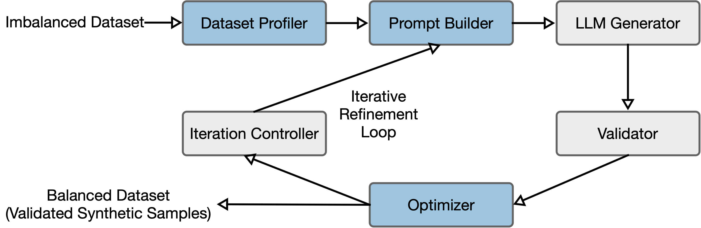

# QualSynth: Quality-controlled synthetic oversampling for imbalanced tabular classification using large language models

[PyPI version](https://pypi.org/project/qualsynth/)
[Python 3.8+](https://www.python.org/downloads/)
[License: GPL v3](https://www.gnu.org/licenses/gpl-3.0)

**QualSynth** is a Python package that leverages Large Language Models (LLMs) with iterative refinement to generate quality-validated synthetic samples for imbalanced classification tasks.



## Key Features

- **LLM-Guided Generation**: Uses LLMs to generate contextually aware synthetic samples that respect domain constraints
- **Multi-Stage Validation**: Combines schema validation, statistical checks, and duplicate detection
- **Anchor-Centric Approach**: Generates controlled variations of real minority samples rather than fitting a dedicated generator for each dataset
- **Near-Zero Raw Duplication**: The benchmark study reports an effectively zero raw exact duplicate rate for QualSynth in archived generated outputs
- **No Dataset-Specific Generator Training**: The benchmarked workflow uses a general-purpose instruction-tuned LLM plus prompting and validation
- **Multiple LLM Backends**: Supports OpenAI, Ollama (local), OpenRouter, and custom endpoints

## Performance Highlights

The accompanying benchmark study evaluates QualSynth on **8 benchmark datasets** across **1200 experiments** (8 datasets × 10 seeds × 5 methods × 3 classifiers). The primary comparison uses each method's native resampled training outputs for downstream classification, while a separate quality audit summarizes post-validation acceptance and raw exact duplication. The summary below reflects the current Scientific Reports manuscript:


| Metric | QualSynth | SMOTE | CTGAN | TabFairGDT | TabDDPM |
| ---------------------- | --------- | ----- | ----- | ---------- | ------- |
| **Avg. F1 Rank** | **2.38** | 2.62 | 2.75 | 3.50 | 3.75 |
| **Avg. ROC-AUC Rank** | **1.96** | 3.00 | 4.04 | 2.50 | 3.50 |
| **Raw Exact Dup. Rate** | **0.0%** | 2.01% | 0.03% | 23.82% | 21.76% |

In the matched five-method ROC-AUC analysis, the global Friedman test is significant (`χ² = 15.50`, `p = 0.0038`). After Holm correction, QualSynth remains significantly ahead of both CTGAN and TabDDPM (`adjusted p = 0.031` for each comparison).


## Quick Start

### Installation

**From PyPI (Recommended):**

```bash
pip install qualsynth
```

**From Source:**

```bash
# Clone the repository
git clone https://github.com/asimsinan/qualsynth.git
cd qualsynth

# Install in development mode
pip install -e .
```

**Verify Installation:**

```python
from qualsynth import QualSynthGenerator
print("QualSynth installed successfully!")
```

### Basic Usage

```python
from qualsynth import QualSynthGenerator

# Initialize generator
generator = QualSynthGenerator(
    model_name="gpt-4",
    api_key="your-openai-api-key",  # Or set OPENAI_API_KEY env var
    temperature=0.7,
    max_iterations=20
)

# Generate synthetic samples
X_synthetic, y_synthetic = generator.fit_generate(X_train, y_train)

# Combine with original data for training
X_augmented = pd.concat([X_train, X_synthetic])
y_augmented = pd.concat([y_train, y_synthetic])
```

### Using Local LLMs (Ollama)

```python
from qualsynth import QualSynthGenerator

# First, start Ollama server: ollama serve
# Pull a model: ollama pull gemma3:12b

generator = QualSynthGenerator(
    model_name="gemma3:12b",  # Model name from 'ollama list'
    api_base="http://localhost:11434/v1"
)

X_synthetic, y_synthetic = generator.fit_generate(X_train, y_train)
```

### Using OpenRouter (Cloud)

```python
from qualsynth import QualSynthGenerator

generator = QualSynthGenerator(
    model_name="google/gemma-2-9b-it",
    api_key="your-openrouter-api-key",
    api_base="https://openrouter.ai/api/v1"
)

X_synthetic, y_synthetic = generator.fit_generate(X_train, y_train)
```

## Project Structure

```
qualsynth/
├── src/qualsynth/           # Main package source code
│   ├── core/                # Core workflow logic
│   │   └── iterative_workflow.py
│   ├── generators/          # Sample generation
│   │   └── counterfactual_generator.py
│   ├── validation/          # Multi-stage validation
│   │   ├── adaptive_validator.py
│   │   └── universal_validator.py
│   ├── modules/             # LLM-powered modules
│   │   ├── dataset_profiler.py
│   │   ├── schema_profiler.py
│   │   ├── diversity_planner.py
│   │   ├── fairness_auditor.py
│   │   └── validator.py
│   ├── baselines/           # Baseline implementations
│   │   ├── smote.py
│   │   ├── ctgan_baseline.py
│   │   └── tabfairgdt.py
│   ├── evaluation/          # Metrics and classifiers
│   └── prompts/             # LLM prompt templates
├── configs/                 # Dataset and method configurations
├── data/                    # Raw benchmark CSVs and prebuilt stratified splits
├── scripts/                 # Development experiment scripts
└── sreport/                 # Scientific Reports manuscript sources
```

## 🔧 Configuration Options


| Parameter              | Default        | Description                                    |
| ---------------------- | -------------- | ---------------------------------------------- |
| `model_name`           | `"gemma3:12b"` | LLM model to use                               |
| `api_key`              | `None`         | API key for cloud providers                    |
| `api_base`             | `None`         | Custom API endpoint URL                        |
| `temperature`          | `0.7`          | Generation diversity (lower = more consistent) |
| `batch_size`           | `20`           | Samples per LLM call                           |
| `max_iterations`       | `20`           | Maximum refinement iterations                  |
| `target_ratio`         | `1.0`          | Target class ratio (1.0 = balanced)            |
| `validation_threshold` | `4.5`          | Statistical validation threshold (σ)           |
| `sensitive_attributes` | `None`         | Columns for fairness-aware generation          |


## Datasets

The accompanying benchmark study evaluates QualSynth on 8 benchmark datasets:


| Dataset       | Domain       | Samples | Features | Imbalance Ratio |
| ------------- | ------------ | ------- | -------- | --------------- |
| German Credit | Finance      | 1,000   | 20       | 2.33:1          |
| Breast Cancer | Medical      | 569     | 30       | 1.68:1          |
| Pima Diabetes | Medical      | 768     | 8        | 1.87:1          |
| Haberman      | Medical      | 306     | 3        | 2.78:1          |
| Wine Quality  | Food Science | 6,497   | 12       | 4.09:1          |
| Yeast         | Biology      | 1,484   | 8        | 28.10:1         |
| Thyroid       | Medical      | 3,772   | 28       | 15.33:1         |
| HTRU2         | Astronomy    | 17,898  | 8        | 9.92:1          |


## Reproducing Experiments

The main runnable code for the benchmark lives under `src/`, `scripts/`, `configs/`, and `data/`.

### Benchmark Configuration Used in the Manuscript

The Scientific Reports manuscript benchmark used the following archived execution setup:

| Item | Setting |
| --- | --- |
| Backend | OpenRouter OpenAI-compatible endpoint |
| LLM | `google/gemma-3-27b-it:free` |
| Thinking mode | Not applicable to the archived benchmark backend |
| Benchmark grid | 8 datasets, 10 seeds, 5 generation methods, 3 downstream classifiers |
| Sampling controls | `temperature=0.7`, `top_p=0.90`, `presence_penalty=0.3`, `frequency_penalty=0.3` |
| Iteration controls | `batch_size=20`, `min_iterations=3`, `stall_iterations=10` |
| Anchor design | Stratified anchor selection with 12 anchors |
| Few-shot setting | 5 examples with dynamic cycling across `rotate`, `edge_cases`, and `stratified` |
| Validation settings | `quality_threshold=0.5`, `adaptive_std_threshold=4.0`, `adaptive_percentile_threshold=0.995` |
| Selection objective | Quality/performance and diversity; fairness disabled in the benchmarked workflow |

For local LM Studio usage, the current experiment runner auto-detects the first non-embedding model returned by `/v1/models` when no explicit `--model` override is supplied. That local path is supported by the codebase, but the manuscript benchmark is tied to the archived OpenRouter-backed run above.

The key practical point from the manuscript is that QualSynth achieved strong benchmark performance without training a dataset-specific generator for each task. This differentiates it from dedicated generative baselines such as TabDDPM while keeping the workflow reproducible through prompts, validation rules, and archived outputs.

### Representative Prompt Contract

The runtime prompt is assembled programmatically, but the benchmarked method follows the fixed contract below:

```text
SYSTEM
You are an expert synthetic data generator for statistically representative,
high-quality tabular data for machine-learning applications.
Generate realistic feature values only.
Do not return explanations, reasoning, markdown, or commentary.

USER
TASK: Generate EXACTLY <n_samples> synthetic minority-class samples.
Dataset: <dataset_name>
Return feature values only; do not include the class label as a field.

SCHEMA AND COLUMN ORDER
<feature_1>, <feature_2>, ..., <feature_d>

CONSTRAINTS
- Match the minority-class distribution
- Stay within valid ranges and allowed categories
- Respect schema, logical, and statistical constraints
- Avoid duplicate and near-duplicate samples
- Ensure feature variation across the generated batch

ANCHOR-CENTRIC RULE
- Start each row from a real minority-class anchor
- Modify only 1-2 features per row
- Keep all remaining anchor fields unchanged

ANCHORS
A1: <feature_1=value_1, feature_2=value_2, ...>
A2: <feature_1=value_1, feature_2=value_2, ...>
...

FEW-SHOT CONTEXT
Example 1: <valid minority-class row>
Example 2: <valid minority-class row>
...

OUTPUT CONTRACT
- Return ONLY a machine-parseable array of samples
- Every sample must contain ALL listed features
- No text before or after the output
```

Later refinement rounds may append diversity reminders, sparse-region examples, and short feedback from the previous generation round.

Prerequisites:

- `data/raw/` contains the eight benchmark CSVs
- `data/splits/<dataset>/split_seed*.pkl` contains the ten prebuilt stratified splits per dataset
- dependencies are installed from the project environment

Smoke-check one experiment:

```bash
python scripts/run_experiments.py main_experiments --datasets german_credit --methods smote --seeds 42
```

Run the full configured matrix:

```bash
python scripts/run_experiments.py main_experiments
```

Useful checks:

```bash
python scripts/run_experiments.py --help
python scripts/run_experiments.py main_experiments --datasets thyroid --methods qualsynth --seeds 42 --max-iterations 1
```

`scripts/run_experiments.py` reads dataset, method, and experiment settings from `configs/` and loads the matching raw/split assets from `data/`. The default output directory follows `configs/experiments/main_experiments.yaml` and writes results under `results/experiments/main/`.

## License

This project is licensed under the GNU General Public License v3.0 (GPL-3.0) - see the [LICENSE](LICENSE) file for details.

## Contributing

Contributions are welcome! Please feel free to submit a Pull Request.

1. Fork the repository
2. Create your feature branch (`git checkout -b feature/AmazingFeature`)
3. Commit your changes (`git commit -m 'Add some AmazingFeature'`)
4. Push to the branch (`git push origin feature/AmazingFeature`)
5. Open a Pull Request

## Contact

**Asım Sinan Yüksel**  
Department of Computer Engineering  
Süleyman Demirel University  
Email: [asimyuksel@sdu.edu.tr](mailto:asimyuksel@sdu.edu.tr)